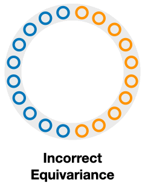

**Abstract:** Extensive work has demonstrated that equivariant neural networks can significantly improve sample efficiency and generalization by enforcing an inductive bias in the network architecture. These applications typically assume that the domain symmetry is fully described by explicit transformations of the model inputs and outputs. However, many real-life applications contain only latent or partial symmetries which cannot be easily described by simple transformations of the input. In these cases, it is necessary to learn symmetry in the environment instead of imposing it mathematically on the network architecture. We discover, surprisingly, that imposing equivariance constraints that do not exactly match the domain symmetry is very helpful in learning the true symmetry in the environment. We differentiate between extrinsic and incorrect symmetry constraints and show that while imposing incorrect symmetry can impede the model's performance, imposing extrinsic symmetry can actually improve performance. We demonstrate that an equivariant model can significantly outperform non-equivariant methods on domains with latent symmetries both in supervised learning and in reinforcement learning for robotic manipulation and control problems.

<style>
.column {
  float: left;
  width: 33.33%;
}
.row:after {
  content: "";
  display: table;
  clear: both;
}
.lc{
  float: left;
  width: 25%;
}
.caption {
    margin: 0;
    vertical-align: baseline;
    text-align: center;
}
img.rounded {
  object-fit: cover;
  border-radius: 50%;
  height: 120px;
  width: 120px;
  margin-left: auto;
  margin-right: auto;
  display: block;
}
.people_column {
  float: left;
  width: 150px;
}
</style>

## Paper
Published at The Eleventh International Conference on Learning Representations (ICLR 2023)  
**Notable-Top-25% (Spotlight)**  
[arXiv](https://arxiv.org/pdf/2211.09231.pdf)  
[OpenReview](https://openreview.net/forum?id=P4MUGRM4Acu)

<div style="width:100%; display:flex">
  <div class="people_column">
    
    <p class="caption">
      <a href="https://pointw.github.io">Dian Wang</a>
    </p>
  </div>
  <div class="people_column">
    
    <p class="caption">
      <a href="https://jypark0.github.io">Jung Yeon Park</a>
    </p>
  </div>
  <div class="people_column">
    
    <p class="caption">
      <a href="https://www.linkedin.com/in/neel-sortur/">Neel Sortur</a>
    </p>
  </div>
  <div class="people_column">
    
    <p class="caption">
      <a href="https://www.ccs.neu.edu/home/lsw/">Lawson L.S. Wong</a>
    </p>
  </div>
  <div class="people_column">
    
    <p class="caption">
      <a href="https://www.khoury.northeastern.edu/people/robin-walters/">Robin Walters</a>*
    </p>
  </div>
  <div class="people_column">
    
    <p class="caption">
      <a href="http://www.ccs.neu.edu/home/rplatt/">Robert Platt</a>*
    </p>
  </div>
</div>

\*Equal Advising  
Khoury College of Computer Sciences  
Northeastern University

## Idea
Equivariant Networks have shown great benefit for improving sample efficiency.  

<p align="center">
  
</p>

For example, consider the above position estimation task. We can use a rotationally equivariant network which will automatically generalize to different rotations of the same input. However, a **perfect top-down image** is normally required in order to model the problem symmetry as transformations of the input image.  

<p align="center">
  
</p>

Such assumption can be easily violated in the real world where there could be a fixed background or a tilted view angle.  

<p align="center">
  
</p>

In these cases, the transformation of the object will be different from that of the image

<p align="center">
  
</p>

Such object transformation will be hard to model and an equivariant network will not directly apply. 

<p align="center">
  
</p>

we propose to use an equivariant network that encodes the image-wise symmetry instead to help modeling the object-wise symmetry. We call this **extrinsic equivariance**.

To better illustrate the idea of extrinsic equivariance, we will define **correct**, **incorrect**, and **extrinsic** equivariance.

<p align="center">
  
</p>

Consider a classification task where the model needs to classify the blue and orange points in the plane.  

<div>
  <div class="column" style="text-align: center">
    
  </div>
  <div class="column" style="text-align: center">
    
  </div>
  <div class="column" style="text-align: center">
    
  </div>
</div>

<div class="row">
  <div class="column">
    <p>If we enforce reflection symmetry across the horizontal axis, the transformed data under reflection will have the same color as the original data, so the model preserves the problem symmetry, and we call it correct equivariance.</p>
  </div>
  <div class="column">
    <p>If we enforce rotation symmetry by pi, the transformed data under the rotation will have different color as the original data, so the model will be forced to generate wrong answers, and we call it incorrect equivariance.</p>
  </div>
  <div class="column">
    <p>If we enforce scale symmetry, the transformed data under scaling will be outside of the input distribution shown in the gray ring, so we call it extrinsic equivariance. </p>
  </div>
</div>

<p align="center">
  
</p>

Our hypothesis is that extrinsic equivariance can be helpful because it makes it easier for the network to generate the decision boundary. 

<p align="center">
  
</p>

We test our proposal in robotic manipulation (and in other domains, please see the paper), where the observation is taken from a camera with a tilted view angle. We show that the extrinsic equivariant methods <span style="color: #3b3bff">(blue)</span> significantly outperforms the unconstrained baselines.

## Video

<div style="text-align:center">
  <iframe width="853" height="480" src="https://www.youtube.com/embed/US4uWndGx9I" frameborder="0" allow="autoplay; encrypted-media" allowfullscreen></iframe>
</div>

## Code
[https://github.com/pointW/extrinsic_equi](https://github.com/pointW/extrinsic_equi)

## Citation

```
@inproceedings{
wang2023surprising,
title={The Surprising Effectiveness of Equivariant Models in Domains with Latent Symmetry},
author={Dian Wang and Jung Yeon Park and Neel Sortur and Lawson L.S. Wong and Robin Walters and Robert Platt},
booktitle={International Conference on Learning Representations},
year={2023},
url={https://openreview.net/forum?id=P4MUGRM4Acu}
}
```


## Contact
If you have any questions, please feel free to contact [Dian Wang](https://pointw.github.io) at wang[dot]dian[at]northeastern[dot]edu.
